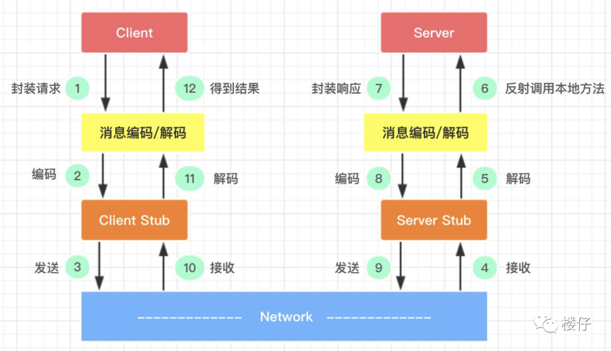
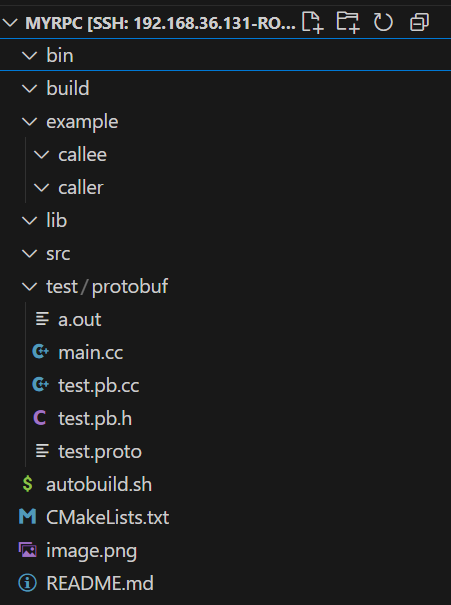
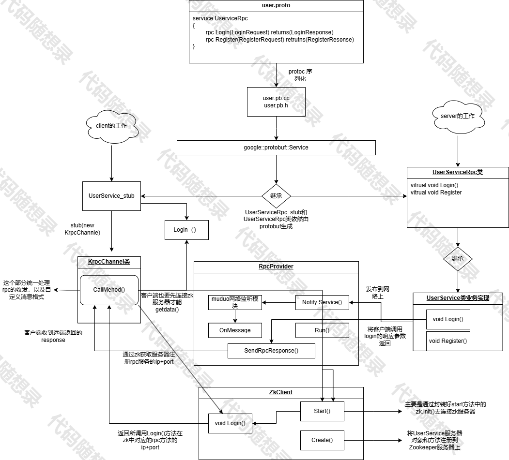
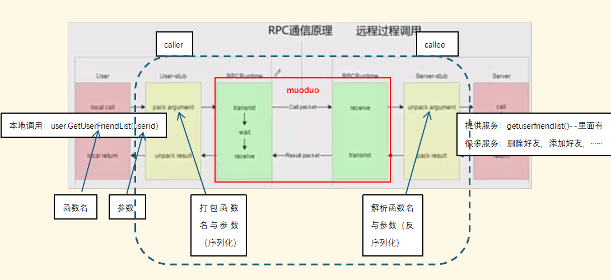

### 代码框架
\

1.      example是简单业务实现
|___callee是服务提供者\
|___caller是服务的调用者


2.      src是RPC框架的源文件
|___myrpcapplication模块\
|___myrpcconfig模块\
|___rpcprovider模块\
|___rpcheader模块


# 项目创建思路
### 第一步：`example目录`下写user.proto
文件目录下运行：protoc user.proto --cpp_out=./
会生成user.pb.h和user.pb.cc
(提供google::protobuf::Servie服务抽象类)

### 第二步：`callee目录`下写userservice.cc
文件目录下运行：g++ *.cc -lprotobuf

### 第三步：`src目录`下写服务提供者的框架代码


# 整体解读


首先，服务提供方通过rpcprovider模块向rpc注册服务相关信息\

```cpp
//[userservice.cc文件]提供服务的发布者与消费者，provider是一个rpc网络服务对象，把服务发布到rpc节点上
    RpcProvider provider; //负责数据序列化反序列化以及收发
    provider.NotifyService(new UserService());
```
通过protobuf提供的抽象Service、method函数将服务以及对应的方法记录在map表中
```cpp
//[rpcprovider.h文件]存储注册成功的服务对象和其服务方法的所有信息
std::unordered_map<std::string, ServiceInfo> m_serviceMap;
//service服务类型信息
struct ServiceInfo
{
    google::protobuf::Service *m_service; //保存服务对象
    std::unordered_map<std::string, const google::protobuf::MethodDescriptor*> m_methodMap; //保存服务方法
};
```
serviceMap{`key:` service_name -> `value:` serviceinfo}\
serviceinfo<*m_service, m_methodMap>\
m_methodMap{`key:` method_name -> `value:` pmethodDesc}\

启动以后，就是启动一个epoll+多线程的服务器（muduo网络库）
```cpp
//[rpcprovider.cc]启动网络服务
server.start();
m_eventloop.loop();
```
启动后可以接收远程连接，如果有远程的新连接到来，muduo库会调用onConnection函数
```cpp
//[rpcprovider.cc]新的socket连接回调
void RpcProvider::onConnection(const muduo::net::TcpConnectionPtr &conn){
    if(!conn->connected()){
        //和rpc client断开连接
        conn->shutdown();//对应socket的close
    }
}
```
框架收到远端的rpc调用请求，按照rpcheader.proto定义好的数据头格式（header_size + header_str + args_str）解析，最终解析并取出来service_name和method_name，以及参数信息。\
onMessage()函数根据调用方调用的方法和服务，生成本地的调用请求和结果响应。前面userservice提供的业务方法（Login）就会被调用，接着从请求中取出数据做本地业务，填响应。然后填回调（调用sendRpcResponse()方法），这个方法会进行序列化然后通过网络发送回去。
```cpp
//反序列化结束后获取了服务对象和方法，现在需要调用服务，调用的是发布者提供的逻辑
//生成rpc方法调用的请求request和响应的response参数
google::protobuf::Message *request = service->GetRequestPrototype(method).New();
google::protobuf::Message *response = service->GetResponsePrototype(method).New();
```


